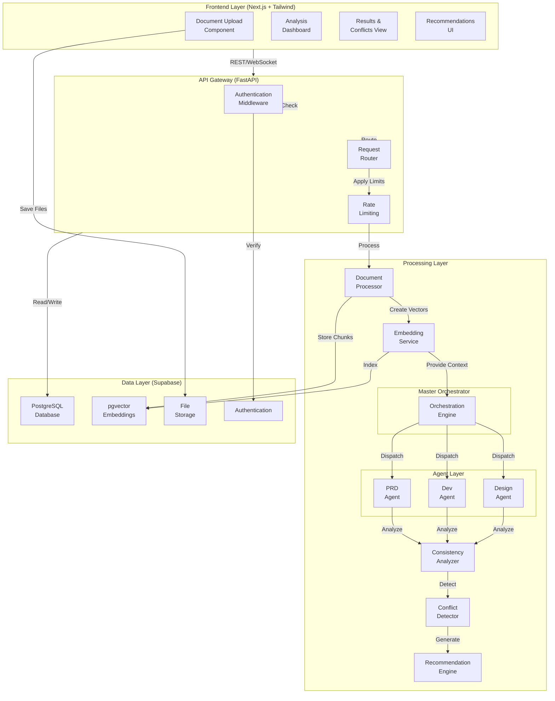
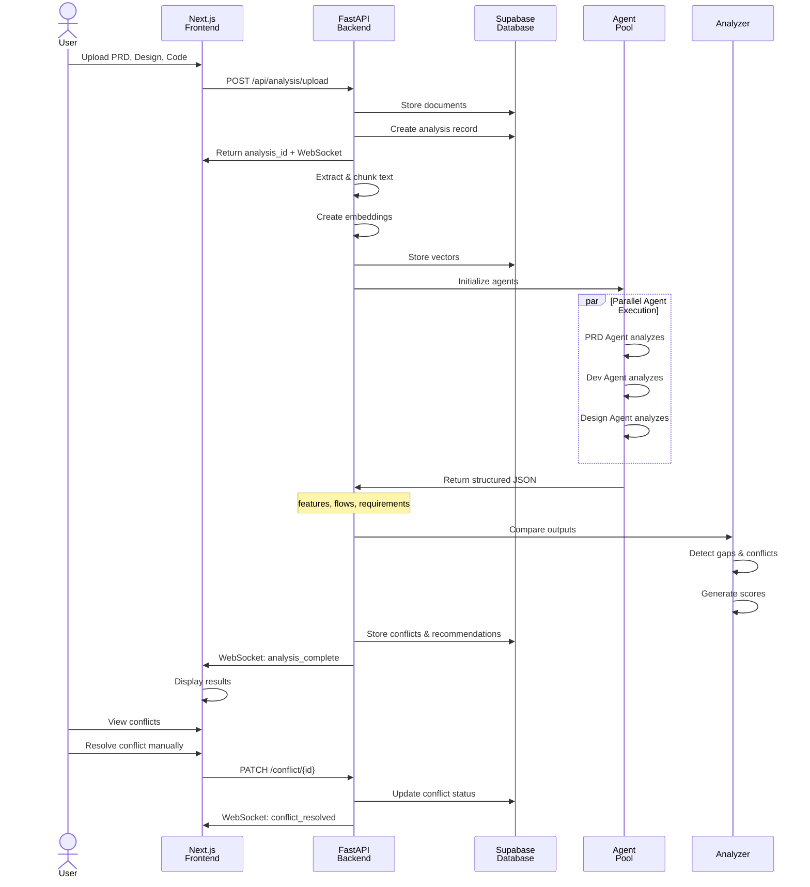
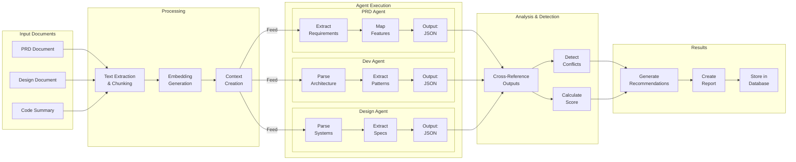
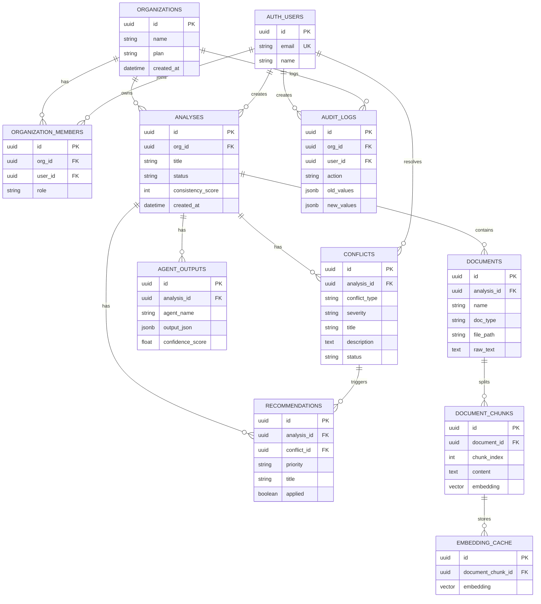
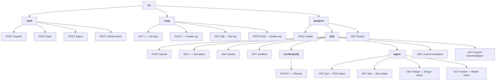
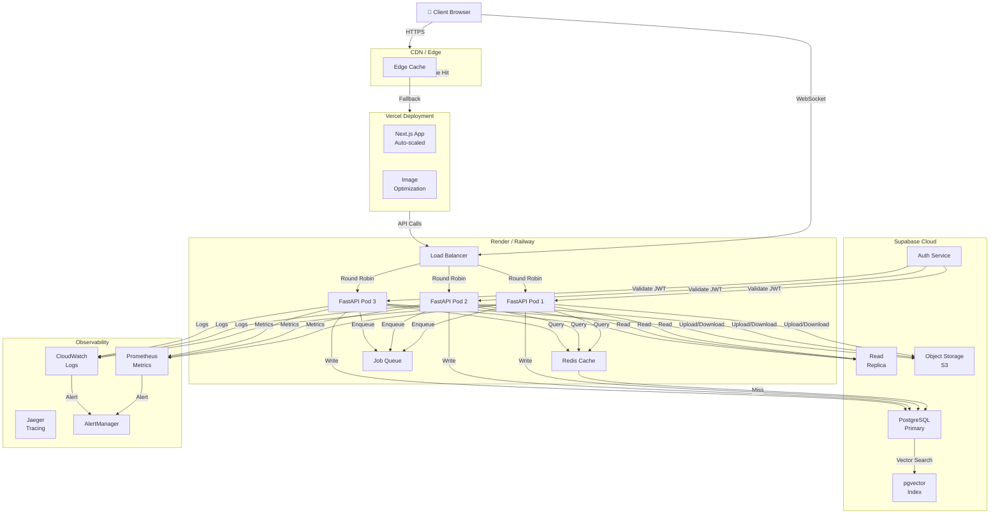
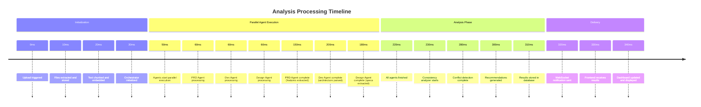
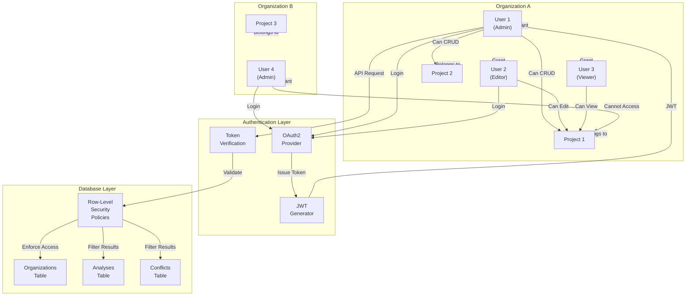
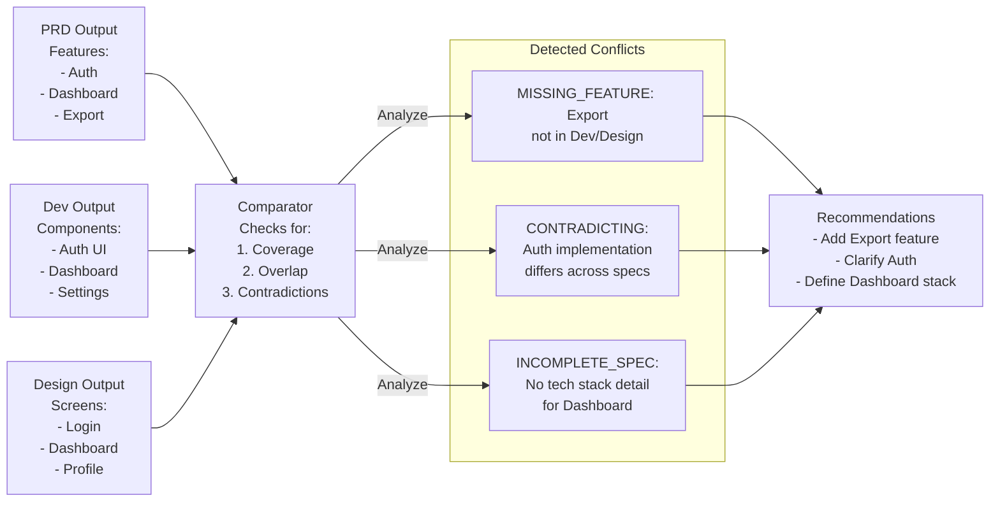

# GenAI Product Consistency Engine - Visual Architecture Diagrams

## System Component Diagram

## Data Flow Diagram

## Agent Communication Flow

## Database Schema Relationship Diagram

## API Endpoint Hierarchy

## Deployment Architecture

## Agent Processing Timeline

## Multi-Tenancy & Security Model

## Conflict Detection Logic

